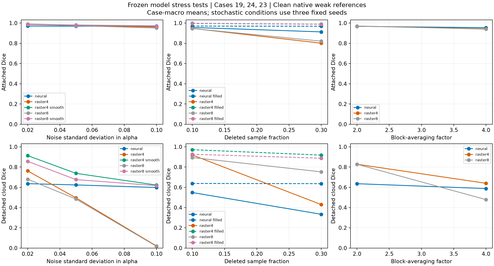

# CavitationCloudML

CFD-supervised segmentation of attached cavities and detached vapor clouds over porous hydrofoils.
Research by Ali Alavi and Ehsan Roohi, University of Massachusetts Amherst.

## What the model does

A compact U-Net (126,275 parameters) takes vapor fraction, a solid mask and wall distance.
It predicts background, attached cavity and detached cloud in a 2-D section.
This is classification of an available CFD field, not prediction of future cavitation,
not optical-image validation, and not verified three-dimensional cloud disconnection.
Training targets use native cell-face connectivity at vapor fraction >= 0.20.
Scores against those targets measure agreement with a deterministic weak reference.

## Data and evaluation

The initial 158 snapshots cover seven cases. Training: 13, 14, 16 and LES.
Cases 19, 24 and 23 were excluded from gradient training but inspected in development.
They are not blind final tests. Stress tests freeze the approved checkpoint and compare
noise, missing values and lower resolution with explicitly specified classical baselines.
Two additional archive cases (8 and 20) were registered before field extraction; see
their separate report before making any generalization claim. No unreported superiority
or fully resolved shedding-frequency claim is made.

## Reproduction

Install `pip install -r requirements.txt`. The processed data/model bundle is prepared locally,
but is not yet publicly downloadable pending data-owner permission and licensing.
When available, extract it into this checkout to restore `results/cavitation_20260912/`.
Run `python tools/infer.py --case Case1LES --output les_prediction.npz`.
Original training and decoder-comparison scripts are included under `tools/`; they
refuse duplicate training. Preserve existing result directories before any new run.
The selected model was adapted for 1,000 steps from the supplied 2,000-step native_v4 parent.
For full training use the checked-in configurations and a separate output directory.
The raw converter uses `data/raw/Ali's Project.zip` and requires 7-Zip; adjust its 7-Zip
executable path for your platform. Raster sampling is nearest-cell, not conservative.

## Movie

[CFD and neural cavitation segmentation](https://youtu.be/x7f_szHKPr8).
Orange: attached; magenta: detached. This movie is a training trajectory (LES),
32 saved snapshots, five-times-slower playback, with no interpolated flow states.
The displayed solid is masked; fluid prediction errors are retained.

## Release scope

Processed data, models, code, figures and the movie are prepared separately from raw CFD.
The original archive contains 21 cases (~15.85 GB); public raw-data permission and licensing
are being confirmed. Publisher PDFs and private documents are excluded.
No additional reuse license is granted in this initial release; publication permission
is distinct from a reuse license. Contact the authors regarding reuse.
Related CFD study: https://doi.org/10.1016/j.oceaneng.2025.122756
Related optical segmentation: https://doi.org/10.1063/5.0345365

## Completed robustness evaluation

See [full numerical report](reports/REPORT.md) and [machine-readable table](reports/SUMMARY.csv).
The frozen model was tested with additive Gaussian noise, random missing values and
2x/4x block averaging. Stochastic conditions use three fixed corruption seeds;
these are not independently trained model seeds. Classical controls include smoothing
and identical nearest-observed imputation. All reference labels remain clean.

**These results do not establish general neural superiority.** At noise standard
deviation 0.10, detached-cloud Dice is 0.598 for the network versus 0.622 for the
smoothed 4-connected baseline. With 30% missing samples and identical imputation,
the corresponding values are 0.636 and 0.918. On two previously unused archive
cases, network cloud Dice is 0.861 (Case 8) and 0.314 (Case 20).
The deterministic references favor their own connectivity construction; this is
not independent manual or experimental validation of either method.

No raw CFD, publisher PDFs, private documents or credentials are committed here.
The original checkpoint fingerprint in historical protocols identifies the local
training artifact. Exported state-only checkpoints have different file hashes but
the same tensors; consult the asset manifest in the released artifact manifest.

Export verification: all 48 asset-member SHA256 values checked; all selected-model tensors
match the original, with bitwise-equal outputs on eight boundary frames from four cases.
